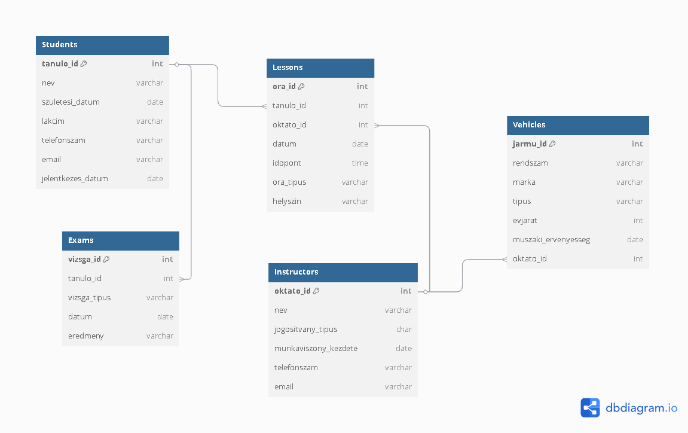

# Autósiskola Adatbázis – SQL + Python Projekt

Ez a projekt egy autósiskola működését modellezi SQL-adatbázis segítségével, Python programozással kiegészítve. A cél, hogy a tanult adatbáziskezelési elveket (lekérdezések, kapcsolatok, CRUD-műveletek) egy valósághoz közeli példán keresztül alkalmazzuk.

---

## 🗂️ Táblák és Kapcsolatok

Az adatbázis az alábbi táblákat tartalmazza:

| Tábla         | Leírás |
|---------------|--------|
| `Students`    | Tanulók adatai |
| `Instructors` | Oktatók adatai |
| `Lessons`     | Órák (tanuló–oktató kapcsolatok) |
| `Vehicles`    | Oktató járművek |
| `Exams`       | Vizsgaeredmények |

### 🔗 Kapcsolatok:

- `Lessons.tanulo_id` → `Students.tanulo_id`
- `Lessons.oktato_id` → `Instructors.oktato_id`
- `Vehicles.oktato_id` → `Instructors.oktato_id`
- `Exams.tanulo_id` → `Students.tanulo_id`

---

## ⚙️ Rendszerkövetelmények

- Python 3.9+
- `pandas`, `pyodbc`
- SQL Server Express 2019
- ODBC Driver 17 for SQL Server
- Jupyter Notebook (opcionális)

---

## 🛠️ Adatbázis Létrehozása

1. `.csv` fájlok betöltése (tanulók, oktatók, órák, vizsgák, járművek)
2. SQL-adatbázis struktúrájának létrehozása Pythonból (CREATE TABLE)
3. Adatok feltöltése `executemany()` használatával
4. Kapcsolódás SQL Serverhez `pyodbc` segítségével

---

## 🔍 Lekérdezések

### 🔍 Lekérdezések

1. Tanulók születési dátum szerint
2. 1990 után született tanulók
3. Tanuló–oktató párosítások
4. Oktatók tanulóinak száma
5. Legalább 2 tanulós oktatók
6. Óraszám típus szerint
7. Oktatónkénti születési rangsor

---

## ✏️ CRUD-műveletek

- **Create:** új tanuló beszúrása
- **Read:** adatok lekérdezése
- **Update:** cím módosítása
- **Delete:** tanuló törlése
- **Feltételes beszúrás:** (`IF EXISTS`)

---

## 🧩 ER Diagram

> A teljes adatmodell vizuálisan:

---

## 📋 Kényszerek összefoglalása

- `PRIMARY KEY`: minden táblán
- `FOREIGN KEY`: megfelelő kapcsolatok a táblák között
- `CHECK`: értékkorlátok pl. jogosítvány típus, óra típus
- `NOT NULL`: kötelező mezők
- `UNIQUE`: jármű rendszám

---

## 👤 Csoporttagok

- Bagi Bereniké (IMN7DS)
- Dobos Kamilla (DEP39C)
- Nagy Boldizsár (JC5KSV)
